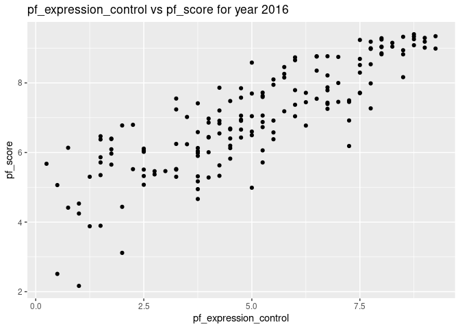
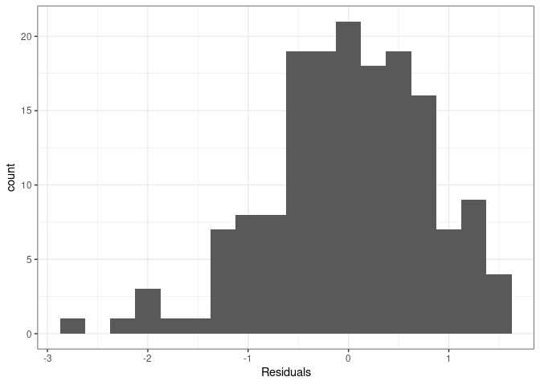

Activity 2 - Day 1
================

``` r
library(tidyverse)
```

    ## ── Attaching packages ─────────────────────────────────────── tidyverse 1.3.2 ──
    ## ✔ ggplot2 3.3.6     ✔ purrr   0.3.4
    ## ✔ tibble  3.1.8     ✔ dplyr   1.0.9
    ## ✔ tidyr   1.2.0     ✔ stringr 1.4.1
    ## ✔ readr   2.1.2     ✔ forcats 0.5.2
    ## ── Conflicts ────────────────────────────────────────── tidyverse_conflicts() ──
    ## ✖ dplyr::filter() masks stats::filter()
    ## ✖ dplyr::lag()    masks stats::lag()

``` r
library(tidymodels)
```

    ## ── Attaching packages ────────────────────────────────────── tidymodels 1.0.0 ──
    ## ✔ broom        1.0.0     ✔ rsample      1.1.0
    ## ✔ dials        1.0.0     ✔ tune         1.0.0
    ## ✔ infer        1.0.3     ✔ workflows    1.0.0
    ## ✔ modeldata    1.0.0     ✔ workflowsets 1.0.0
    ## ✔ parsnip      1.0.1     ✔ yardstick    1.0.0
    ## ✔ recipes      1.0.1     
    ## ── Conflicts ───────────────────────────────────────── tidymodels_conflicts() ──
    ## ✖ scales::discard() masks purrr::discard()
    ## ✖ dplyr::filter()   masks stats::filter()
    ## ✖ recipes::fixed()  masks stringr::fixed()
    ## ✖ dplyr::lag()      masks stats::lag()
    ## ✖ yardstick::spec() masks readr::spec()
    ## ✖ recipes::step()   masks stats::step()
    ## • Learn how to get started at https://www.tidymodels.org/start/

``` r
library(readr)
```

## Task 3: Load the data and

``` r
hfi <- read_csv("https://www.openintro.org/data/csv/hfi.csv");
```

    ## Rows: 1458 Columns: 123
    ## ── Column specification ────────────────────────────────────────────────────────
    ## Delimiter: ","
    ## chr   (3): ISO_code, countries, region
    ## dbl (120): year, pf_rol_procedural, pf_rol_civil, pf_rol_criminal, pf_rol, p...
    ## 
    ## ℹ Use `spec()` to retrieve the full column specification for this data.
    ## ℹ Specify the column types or set `show_col_types = FALSE` to quiet this message.

``` r
glimpse(hfi)
```

    ## Rows: 1,458
    ## Columns: 123
    ## $ year                               <dbl> 2016, 2016, 2016, 2016, 2016, 2016,…
    ## $ ISO_code                           <chr> "ALB", "DZA", "AGO", "ARG", "ARM", …
    ## $ countries                          <chr> "Albania", "Algeria", "Angola", "Ar…
    ## $ region                             <chr> "Eastern Europe", "Middle East & No…
    ## $ pf_rol_procedural                  <dbl> 6.661503, NA, NA, 7.098483, NA, 8.4…
    ## $ pf_rol_civil                       <dbl> 4.547244, NA, NA, 5.791960, NA, 7.5…
    ## $ pf_rol_criminal                    <dbl> 4.666508, NA, NA, 4.343930, NA, 7.3…
    ## $ pf_rol                             <dbl> 5.291752, 3.819566, 3.451814, 5.744…
    ## $ pf_ss_homicide                     <dbl> 8.920429, 9.456254, 8.060260, 7.622…
    ## $ pf_ss_disappearances_disap         <dbl> 10, 10, 5, 10, 10, 10, 10, 10, 10, …
    ## $ pf_ss_disappearances_violent       <dbl> 10.000000, 9.294030, 10.000000, 10.…
    ## $ pf_ss_disappearances_organized     <dbl> 10.0, 5.0, 7.5, 7.5, 7.5, 10.0, 10.…
    ## $ pf_ss_disappearances_fatalities    <dbl> 10.000000, 9.926119, 10.000000, 10.…
    ## $ pf_ss_disappearances_injuries      <dbl> 10.000000, 9.990149, 10.000000, 9.9…
    ## $ pf_ss_disappearances               <dbl> 10.000000, 8.842060, 8.500000, 9.49…
    ## $ pf_ss_women_fgm                    <dbl> 10.0, 10.0, 10.0, 10.0, 10.0, 10.0,…
    ## $ pf_ss_women_missing                <dbl> 7.5, 7.5, 10.0, 10.0, 5.0, 10.0, 10…
    ## $ pf_ss_women_inheritance_widows     <dbl> 5, 0, 5, 10, 10, 10, 10, 5, NA, 0, …
    ## $ pf_ss_women_inheritance_daughters  <dbl> 5, 0, 5, 10, 10, 10, 10, 10, NA, 0,…
    ## $ pf_ss_women_inheritance            <dbl> 5.0, 0.0, 5.0, 10.0, 10.0, 10.0, 10…
    ## $ pf_ss_women                        <dbl> 7.500000, 5.833333, 8.333333, 10.00…
    ## $ pf_ss                              <dbl> 8.806810, 8.043882, 8.297865, 9.040…
    ## $ pf_movement_domestic               <dbl> 5, 5, 0, 10, 5, 10, 10, 5, 10, 10, …
    ## $ pf_movement_foreign                <dbl> 10, 5, 5, 10, 5, 10, 10, 5, 10, 5, …
    ## $ pf_movement_women                  <dbl> 5, 5, 10, 10, 10, 10, 10, 5, NA, 5,…
    ## $ pf_movement                        <dbl> 6.666667, 5.000000, 5.000000, 10.00…
    ## $ pf_religion_estop_establish        <dbl> NA, NA, NA, NA, NA, NA, NA, NA, NA,…
    ## $ pf_religion_estop_operate          <dbl> NA, NA, NA, NA, NA, NA, NA, NA, NA,…
    ## $ pf_religion_estop                  <dbl> 10.0, 5.0, 10.0, 7.5, 5.0, 10.0, 10…
    ## $ pf_religion_harassment             <dbl> 9.566667, 6.873333, 8.904444, 9.037…
    ## $ pf_religion_restrictions           <dbl> 8.011111, 2.961111, 7.455556, 6.850…
    ## $ pf_religion                        <dbl> 9.192593, 4.944815, 8.786667, 7.795…
    ## $ pf_association_association         <dbl> 10.0, 5.0, 2.5, 7.5, 7.5, 10.0, 10.…
    ## $ pf_association_assembly            <dbl> 10.0, 5.0, 2.5, 10.0, 7.5, 10.0, 10…
    ## $ pf_association_political_establish <dbl> NA, NA, NA, NA, NA, NA, NA, NA, NA,…
    ## $ pf_association_political_operate   <dbl> NA, NA, NA, NA, NA, NA, NA, NA, NA,…
    ## $ pf_association_political           <dbl> 10.0, 5.0, 2.5, 5.0, 5.0, 10.0, 10.…
    ## $ pf_association_prof_establish      <dbl> NA, NA, NA, NA, NA, NA, NA, NA, NA,…
    ## $ pf_association_prof_operate        <dbl> NA, NA, NA, NA, NA, NA, NA, NA, NA,…
    ## $ pf_association_prof                <dbl> 10.0, 5.0, 5.0, 7.5, 5.0, 10.0, 10.…
    ## $ pf_association_sport_establish     <dbl> NA, NA, NA, NA, NA, NA, NA, NA, NA,…
    ## $ pf_association_sport_operate       <dbl> NA, NA, NA, NA, NA, NA, NA, NA, NA,…
    ## $ pf_association_sport               <dbl> 10.0, 5.0, 7.5, 7.5, 7.5, 10.0, 10.…
    ## $ pf_association                     <dbl> 10.0, 5.0, 4.0, 7.5, 6.5, 10.0, 10.…
    ## $ pf_expression_killed               <dbl> 10.000000, 10.000000, 10.000000, 10…
    ## $ pf_expression_jailed               <dbl> 10.000000, 10.000000, 10.000000, 10…
    ## $ pf_expression_influence            <dbl> 5.0000000, 2.6666667, 2.6666667, 5.…
    ## $ pf_expression_control              <dbl> 5.25, 4.00, 2.50, 5.50, 4.25, 7.75,…
    ## $ pf_expression_cable                <dbl> 10.0, 10.0, 7.5, 10.0, 7.5, 10.0, 1…
    ## $ pf_expression_newspapers           <dbl> 10.0, 7.5, 5.0, 10.0, 7.5, 10.0, 10…
    ## $ pf_expression_internet             <dbl> 10.0, 7.5, 7.5, 10.0, 7.5, 10.0, 10…
    ## $ pf_expression                      <dbl> 8.607143, 7.380952, 6.452381, 8.738…
    ## $ pf_identity_legal                  <dbl> 0, NA, 10, 10, 7, 7, 10, 0, NA, NA,…
    ## $ pf_identity_parental_marriage      <dbl> 10, 0, 10, 10, 10, 10, 10, 10, 10, …
    ## $ pf_identity_parental_divorce       <dbl> 10, 5, 10, 10, 10, 10, 10, 10, 10, …
    ## $ pf_identity_parental               <dbl> 10.0, 2.5, 10.0, 10.0, 10.0, 10.0, …
    ## $ pf_identity_sex_male               <dbl> 10, 0, 0, 10, 10, 10, 10, 10, 10, 1…
    ## $ pf_identity_sex_female             <dbl> 10, 0, 0, 10, 10, 10, 10, 10, 10, 1…
    ## $ pf_identity_sex                    <dbl> 10, 0, 0, 10, 10, 10, 10, 10, 10, 1…
    ## $ pf_identity_divorce                <dbl> 5, 0, 10, 10, 5, 10, 10, 5, NA, 0, …
    ## $ pf_identity                        <dbl> 6.2500000, 0.8333333, 7.5000000, 10…
    ## $ pf_score                           <dbl> 7.596281, 5.281772, 6.111324, 8.099…
    ## $ pf_rank                            <dbl> 57, 147, 117, 42, 84, 11, 8, 131, 6…
    ## $ ef_government_consumption          <dbl> 8.232353, 2.150000, 7.600000, 5.335…
    ## $ ef_government_transfers            <dbl> 7.509902, 7.817129, 8.886739, 6.048…
    ## $ ef_government_enterprises          <dbl> 8, 0, 0, 6, 8, 10, 10, 0, 7, 10, 7,…
    ## $ ef_government_tax_income           <dbl> 9, 7, 10, 7, 5, 5, 4, 9, 10, 10, 8,…
    ## $ ef_government_tax_payroll          <dbl> 7, 2, 9, 1, 5, 5, 3, 4, 10, 10, 8, …
    ## $ ef_government_tax                  <dbl> 8.0, 4.5, 9.5, 4.0, 5.0, 5.0, 3.5, …
    ## $ ef_government                      <dbl> 7.935564, 3.616782, 6.496685, 5.346…
    ## $ ef_legal_judicial                  <dbl> 2.6682218, 4.1867042, 1.8431292, 3.…
    ## $ ef_legal_courts                    <dbl> 3.145462, 4.327113, 1.974566, 2.930…
    ## $ ef_legal_protection                <dbl> 4.512228, 4.689952, 2.512364, 4.255…
    ## $ ef_legal_military                  <dbl> 8.333333, 4.166667, 3.333333, 7.500…
    ## $ ef_legal_integrity                 <dbl> 4.166667, 5.000000, 4.166667, 3.333…
    ## $ ef_legal_enforcement               <dbl> 4.3874441, 4.5075380, 2.3022004, 3.…
    ## $ ef_legal_restrictions              <dbl> 6.485287, 6.626692, 5.455882, 6.857…
    ## $ ef_legal_police                    <dbl> 6.933500, 6.136845, 3.016104, 3.385…
    ## $ ef_legal_crime                     <dbl> 6.215401, 6.737383, 4.291197, 4.133…
    ## $ ef_legal_gender                    <dbl> 0.9487179, 0.8205128, 0.8461538, 0.…
    ## $ ef_legal                           <dbl> 5.071814, 4.690743, 2.963635, 3.904…
    ## $ ef_money_growth                    <dbl> 8.986454, 6.955962, 9.385679, 5.233…
    ## $ ef_money_sd                        <dbl> 9.484575, 8.339152, 4.986742, 5.224…
    ## $ ef_money_inflation                 <dbl> 9.743600, 8.720460, 3.054000, 2.000…
    ## $ ef_money_currency                  <dbl> 10, 5, 5, 10, 10, 10, 10, 5, 0, 10,…
    ## $ ef_money                           <dbl> 9.553657, 7.253894, 5.606605, 5.614…
    ## $ ef_trade_tariffs_revenue           <dbl> 9.626667, 8.480000, 8.993333, 6.060…
    ## $ ef_trade_tariffs_mean              <dbl> 9.24, 6.22, 7.72, 7.26, 8.76, 9.50,…
    ## $ ef_trade_tariffs_sd                <dbl> 8.0240, 5.9176, 4.2544, 5.9448, 8.0…
    ## $ ef_trade_tariffs                   <dbl> 8.963556, 6.872533, 6.989244, 6.421…
    ## $ ef_trade_regulatory_nontariff      <dbl> 5.574481, 4.962589, 3.132738, 4.466…
    ## $ ef_trade_regulatory_compliance     <dbl> 9.4053278, 0.0000000, 0.9171598, 5.…
    ## $ ef_trade_regulatory                <dbl> 7.489905, 2.481294, 2.024949, 4.811…
    ## $ ef_trade_black                     <dbl> 10.00000, 5.56391, 10.00000, 0.0000…
    ## $ ef_trade_movement_foreign          <dbl> 6.306106, 3.664829, 2.946919, 5.358…
    ## $ ef_trade_movement_capital          <dbl> 4.6153846, 0.0000000, 3.0769231, 0.…
    ## $ ef_trade_movement_visit            <dbl> 8.2969231, 1.1062564, 0.1106256, 7.…
    ## $ ef_trade_movement                  <dbl> 6.406138, 1.590362, 2.044823, 4.697…
    ## $ ef_trade                           <dbl> 8.214900, 4.127025, 5.264754, 3.982…
    ## $ ef_regulation_credit_ownership     <dbl> 5, 0, 8, 5, 10, 10, 8, 5, 10, 10, 5…
    ## $ ef_regulation_credit_private       <dbl> 7.295687, 5.301526, 9.194715, 4.259…
    ## $ ef_regulation_credit_interest      <dbl> 9, 10, 4, 7, 10, 10, 10, 9, 10, 10,…
    ## $ ef_regulation_credit               <dbl> 7.098562, 5.100509, 7.064905, 5.419…
    ## $ ef_regulation_labor_minwage        <dbl> 5.566667, 5.566667, 8.900000, 2.766…
    ## $ ef_regulation_labor_firing         <dbl> 5.396399, 3.896912, 2.656198, 2.191…
    ## $ ef_regulation_labor_bargain        <dbl> 6.234861, 5.958321, 5.172987, 3.432…
    ## $ ef_regulation_labor_hours          <dbl> 8, 6, 4, 10, 10, 10, 6, 6, 8, 8, 10…
    ## $ ef_regulation_labor_dismissal      <dbl> 6.299741, 7.755176, 6.632764, 2.517…
    ## $ ef_regulation_labor_conscription   <dbl> 10, 1, 0, 10, 0, 10, 3, 1, 10, 10, …
    ## $ ef_regulation_labor                <dbl> 6.916278, 5.029513, 4.560325, 5.151…
    ## $ ef_regulation_business_adm         <dbl> 6.072172, 3.722341, 2.758428, 2.404…
    ## $ ef_regulation_business_bureaucracy <dbl> 6.000000, 1.777778, 1.333333, 6.666…
    ## $ ef_regulation_business_start       <dbl> 9.713864, 9.243070, 8.664627, 9.122…
    ## $ ef_regulation_business_bribes      <dbl> 4.050196, 3.765515, 1.945540, 3.260…
    ## $ ef_regulation_business_licensing   <dbl> 7.324582, 8.523503, 8.096776, 5.253…
    ## $ ef_regulation_business_compliance  <dbl> 7.074366, 7.029528, 6.782923, 6.508…
    ## $ ef_regulation_business             <dbl> 6.705863, 5.676956, 4.930271, 5.535…
    ## $ ef_regulation                      <dbl> 6.906901, 5.268992, 5.518500, 5.369…
    ## $ ef_score                           <dbl> 7.54, 4.99, 5.17, 4.84, 7.57, 7.98,…
    ## $ ef_rank                            <dbl> 34, 159, 155, 160, 29, 10, 27, 106,…
    ## $ hf_score                           <dbl> 7.568140, 5.135886, 5.640662, 6.469…
    ## $ hf_rank                            <dbl> 48, 155, 142, 107, 57, 4, 16, 130, …
    ## $ hf_quartile                        <dbl> 2, 4, 4, 3, 2, 1, 1, 4, 2, 2, 4, 2,…

``` r
head(hfi)
```

    ## # A tibble: 6 × 123
    ##    year ISO_code countries region pf_ro…¹ pf_ro…² pf_ro…³ pf_rol pf_ss…⁴ pf_ss…⁵
    ##   <dbl> <chr>    <chr>     <chr>    <dbl>   <dbl>   <dbl>  <dbl>   <dbl>   <dbl>
    ## 1  2016 ALB      Albania   Easte…    6.66    4.55    4.67   5.29    8.92      10
    ## 2  2016 DZA      Algeria   Middl…   NA      NA      NA      3.82    9.46      10
    ## 3  2016 AGO      Angola    Sub-S…   NA      NA      NA      3.45    8.06       5
    ## 4  2016 ARG      Argentina Latin…    7.10    5.79    4.34   5.74    7.62      10
    ## 5  2016 ARM      Armenia   Cauca…   NA      NA      NA      5.00    8.81      10
    ## 6  2016 AUS      Australia Ocean…    8.44    7.53    7.36   7.78    9.62      10
    ## # … with 113 more variables: pf_ss_disappearances_violent <dbl>,
    ## #   pf_ss_disappearances_organized <dbl>,
    ## #   pf_ss_disappearances_fatalities <dbl>, pf_ss_disappearances_injuries <dbl>,
    ## #   pf_ss_disappearances <dbl>, pf_ss_women_fgm <dbl>,
    ## #   pf_ss_women_missing <dbl>, pf_ss_women_inheritance_widows <dbl>,
    ## #   pf_ss_women_inheritance_daughters <dbl>, pf_ss_women_inheritance <dbl>,
    ## #   pf_ss_women <dbl>, pf_ss <dbl>, pf_movement_domestic <dbl>, …

After doing this and viewing the loaded data, answer the following
questions:

1.  What are the dimensions of the dataset? What does each row
    represent?

    123 variables and 1458 observations.

-   The dataset spans a lot of years. We are only interested in data
    from year 2016.
    -   Create a new R code chunk,
    -   Filter the data `hfi` data frame for year 2016, and
    -   Assign the result to a data frame named `hfi_2016`.

``` r
hfi_2016 <- hfi %>% filter(year == 2016)
head(hfi_2016)
```

    ## # A tibble: 6 × 123
    ##    year ISO_code countries region pf_ro…¹ pf_ro…² pf_ro…³ pf_rol pf_ss…⁴ pf_ss…⁵
    ##   <dbl> <chr>    <chr>     <chr>    <dbl>   <dbl>   <dbl>  <dbl>   <dbl>   <dbl>
    ## 1  2016 ALB      Albania   Easte…    6.66    4.55    4.67   5.29    8.92      10
    ## 2  2016 DZA      Algeria   Middl…   NA      NA      NA      3.82    9.46      10
    ## 3  2016 AGO      Angola    Sub-S…   NA      NA      NA      3.45    8.06       5
    ## 4  2016 ARG      Argentina Latin…    7.10    5.79    4.34   5.74    7.62      10
    ## 5  2016 ARM      Armenia   Cauca…   NA      NA      NA      5.00    8.81      10
    ## 6  2016 AUS      Australia Ocean…    8.44    7.53    7.36   7.78    9.62      10
    ## # … with 113 more variables: pf_ss_disappearances_violent <dbl>,
    ## #   pf_ss_disappearances_organized <dbl>,
    ## #   pf_ss_disappearances_fatalities <dbl>, pf_ss_disappearances_injuries <dbl>,
    ## #   pf_ss_disappearances <dbl>, pf_ss_women_fgm <dbl>,
    ## #   pf_ss_women_missing <dbl>, pf_ss_women_inheritance_widows <dbl>,
    ## #   pf_ss_women_inheritance_daughters <dbl>, pf_ss_women_inheritance <dbl>,
    ## #   pf_ss_women <dbl>, pf_ss <dbl>, pf_movement_domestic <dbl>, …

2.  What type of plot would you use to display the relationship between
    the personal freedom score, `pf_score`, and `pf_expression_control`?

-   Create a new R code chunk and plot this relationship using the
    variable `pf_expression_control` as the predictor.

``` r
hfi_2016 %>% ggplot(aes(pf_expression_control, pf_score)) +
  geom_point() +
  labs(
    title = "pf_expression_control vs pf_score for year 2016",
    x = "pf_expression_control",
    y = "pf_score"
  )
```

<!-- -->

3.  Does the relationship look linear? If you knew a country’s
    `pf_expression_control`, or its score out of 10, with 0 being the
    most, of political pressures and controls on media content, would
    you be comfortable using a linear model to predict the personal
    freedom score?

    The relationship looks positively linear. Based on above graph,
    linear model should be sufficient.

## Task 4: Sum of squared residuals

## Task 5: The linear model

``` r
m1 <- lm(pf_score ~ pf_expression_control, data = hfi_2016)
tidy(m1)
```

    ## # A tibble: 2 × 5
    ##   term                  estimate std.error statistic  p.value
    ##   <chr>                    <dbl>     <dbl>     <dbl>    <dbl>
    ## 1 (Intercept)              4.28     0.149       28.8 4.23e-65
    ## 2 pf_expression_control    0.542    0.0271      20.0 2.31e-45

The y-intercept is 4.28 and slope is 0.541

## Day2: Accessing the Model

``` r
hfi_2016 %>%
  summarize(cor=cor(pf_score,pf_expression_control))
```

    ## # A tibble: 1 × 1
    ##     cor
    ##   <dbl>
    ## 1 0.845

Positive correlation among the variables.

``` r
glance(m1)
```

    ## # A tibble: 1 × 12
    ##   r.squared adj.r.squa…¹ sigma stati…²  p.value    df logLik   AIC   BIC devia…³
    ##       <dbl>        <dbl> <dbl>   <dbl>    <dbl> <dbl>  <dbl> <dbl> <dbl>   <dbl>
    ## 1     0.714        0.712 0.799    400. 2.31e-45     1  -193.  391.  400.    102.
    ## # … with 2 more variables: df.residual <int>, nobs <int>, and abbreviated
    ## #   variable names ¹​adj.r.squared, ²​statistic, ³​deviance

The r-square is 0.714(`71%` accuracy.)

## New Model

``` r
m2 <- lm(hf_score ~ pf_expression_control, data = hfi_2016)
tidy(m2)
```

    ## # A tibble: 2 × 5
    ##   term                  estimate std.error statistic  p.value
    ##   <chr>                    <dbl>     <dbl>     <dbl>    <dbl>
    ## 1 (Intercept)              5.05     0.123       41.1 5.97e-87
    ## 2 pf_expression_control    0.368    0.0224      16.5 2.73e-36

### Prediction and prediction errors

``` r
hfi_2016 %>% 
  ggplot(aes(x=pf_expression_control, y=pf_score)) +
  geom_smooth(method = "lm", se = FALSE) +
  geom_point() + 
  theme_bw() + 
  ggtitle('pf_score vs. pf_expression_control')
```

    ## `geom_smooth()` using formula 'y ~ x'

<!-- -->

### Model Diagnostics

``` r
m1_aug <- augment(m1)
```

``` r
ggplot(data = m1_aug, aes(x = .fitted, y = .resid)) +
  geom_point() +
  geom_hline(yintercept = 0, linetype = "dashed", color = "red") +
  xlab("Fitted values") +
  ylab("Residuals") + 
  theme_bw()
```

<!-- -->
The residuals look like they have constant variance until the higher
predicted values where variance seems to decrease.

``` r
ggplot(data = m1_aug, aes(x = .resid)) +
  geom_histogram(binwidth = 0.25) +
  xlab("Residuals") + 
  theme_bw()
```

<!-- --> The
histogram is slightly skewed which suggest that variablility appears to
be violated.

### Challange: More Practice

``` r
hfi_2016 %>%
  ggplot(aes(x = pf_expression_influence, y = pf_score)) +
  geom_point()
```

<!-- -->

``` r
m3 <- lm(pf_score ~ pf_expression_influence, data = hfi_2016)
tidy(m3)
```

    ## # A tibble: 2 × 5
    ##   term                    estimate std.error statistic  p.value
    ##   <chr>                      <dbl>     <dbl>     <dbl>    <dbl>
    ## 1 (Intercept)                4.72     0.143       33.0 2.26e-73
    ## 2 pf_expression_influence    0.459    0.0256      18.0 3.25e-40

``` r
glance(m3)
```

    ## # A tibble: 1 × 12
    ##   r.squared adj.r.squa…¹ sigma stati…²  p.value    df logLik   AIC   BIC devia…³
    ##       <dbl>        <dbl> <dbl>   <dbl>    <dbl> <dbl>  <dbl> <dbl> <dbl>   <dbl>
    ## 1     0.669        0.667 0.861    323. 3.25e-40     1  -205.  415.  424.    118.
    ## # … with 2 more variables: df.residual <int>, nobs <int>, and abbreviated
    ## #   variable names ¹​adj.r.squared, ²​statistic, ³​deviance
